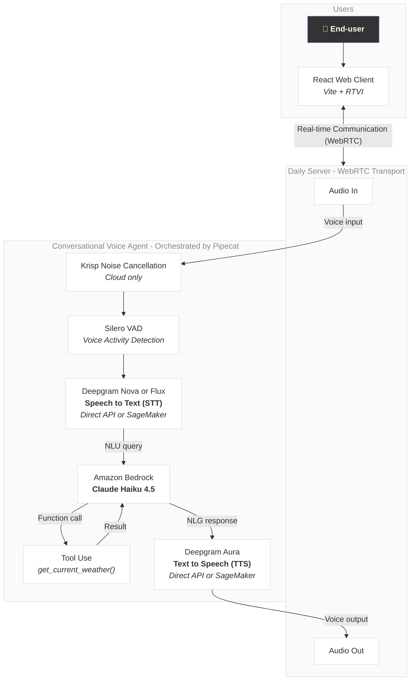

# AWS + Deepgram Voice AI Hackathon: Pipecat Quickstart Project

This is the quickest way to get started building a Pipecat voice AI agent for the AWS + Deepgram Voice AI Hackathon.

It was built with the [Pipecat CLI](https://github.com/pipecat-ai/pipecat-cli), and customized to make it as fast as possible to get a working bot.

## Dependencies
- Python 3.10+
- `uv`
- docker (to deploy to Pipecat Cloud)

## Run your bot locally

```bash
git clone git@github.com:pipecat-ai/aws-deepgram-sa-hackathon.git
cd aws-deepgram-sa-hackathon
```

### Server
In your first terminal window:
```bash
cd server
cp env.example .env # and fill in the values
uv sync
uv run bot.py --transport daily
```

You should see something like:
```bash
INFO     | pipecat:<module>:14 - ᓚᘏᗢ Pipecat 0.0.102 (Python 3.12.0 (main, Oct  2 2023, 20:56:14) [Clang 16.0.3 ]) ᓚᘏᗢ

🚀 Bot ready!
   → Open http://localhost:7860 in your browser to start a session

INFO:     Started server process [91430]
INFO:     Waiting for application startup.
INFO:     Application startup complete.
INFO:     Uvicorn running on http://localhost:7860 (Press CTRL+C to quit)
```

### Client
Then, in another terminal window:

```bash
cd ../client
cp env.example .env.local # and fill in the values
npm i
npm run dev
```

You should see something like:
```bash
  VITE v7.3.1  ready in 206 ms

  ➜  Local:   http://localhost:5173/
  ➜  Network: http://192.168.0.16:5173/
  ➜  Network: http://100.115.25.125:5173/
  ➜  press h + enter to show help
```

Now visit http://localhost:5173 in your browser and click **Connect** to start talking to your bot!

## Architecture Diagram



## Customize the bot

The `server/bot.py` file contains your Pipecat bot. To customize it, look for the comment `#### Customize bot prompt here! Update "content"`. That `messages` variable is used by the bot's context manager, which stores the conversation between the bot and the user. Change the `content` property of that first message to update your bot's system prompt.

Next, you'll almost certainly want to use function calling to extend your bot's functionality. Search for the comments `#### Customize function here!` to see how this bot can answer questions about the weather (using fake data). Read more about function calling in [the Pipecat docs page about it](https://docs.pipecat.ai/guides/learn/function-calling#function-calling).

## Use Deepgram Flux STT

[Deepgram Flux](https://developers.deepgram.com/docs/deepgram-flux) is an advanced STT model with improved turn detection, so it handles the end-of-turn decision instead of relying solely on VAD silence detection.

To enable Flux, set `USE_FLUX=true` in your `server/.env`:

```env
USE_FLUX=true
```

Flux works with both the direct Deepgram API and SageMaker — just combine `USE_FLUX=true` with `USE_SAGEMAKER=true` to use Flux via SageMaker.

## Use Deepgram on AWS SageMaker

Instead of calling the Deepgram API directly, you can run Deepgram models on your own AWS SageMaker endpoints. This keeps all audio data within your AWS account.

To switch to SageMaker mode, update your `server/.env`:

```env
USE_SAGEMAKER=true
SAGEMAKER_STT_ENDPOINT_NAME=my-deepgram-stt-endpoint
SAGEMAKER_TTS_ENDPOINT_NAME=my-deepgram-tts-endpoint
```

You'll need:
1. An AWS account with SageMaker access
2. A deployed SageMaker endpoint with a [Deepgram STT model](https://aws.amazon.com/marketplace/seller-profile?id=seller-k2hljgxsc7bxw)
3. A deployed SageMaker endpoint with a [Deepgram TTS model](https://aws.amazon.com/marketplace/seller-profile?id=seller-k2hljgxsc7bxw)

The existing `AWS_ACCESS_KEY_ID`, `AWS_SECRET_ACCESS_KEY`, and `AWS_REGION` variables are shared with Bedrock and will be used for SageMaker as well.

Set `USE_SAGEMAKER=false` (the default) to go back to using the Deepgram API directly.

## Deploy to Pipecat Cloud

For the hackathon, you can perform your live demo by running the bot locally on your computer. To deliver a hosted version, use [Pipecat Cloud](https://pipecat.daily.co).

To deploy your bot, first you'll want to install the Pipecat CLI if you haven't already, and authenticate with Pipecat Cloud:

```bash
uv tool install pipecat-ai-cli
pipecat cloud auth login
```

You can edit `server/pcc-deploy.toml` if you want to change any Pipecat Cloud settings, but the defaults are fine to get started.

Next, copy the secrets from your .env file to a secret set in Pipecat Cloud, and deploy your bot:

```
cd /server
pipecat cloud secrets set --file .env aws-deepgram-sa-hackathon-secrets # assuming you didn't change the name in pcc-deploy.toml
pipecat cloud deploy
```

The `min_agents = 1` setting in `pcc-deploy.toml` ensures that there's always a bot instance ready to accept a new session. This minimizes session startup time, but also incurs a small cost. After you're done testing, you can set minimum agents to 0 in the [Pipecat Cloud dashboard](https://pipecat.daily.co).

To talk to your agent, create a Pipecat Cloud public key, then start a session. The second command will return a URL you can click to talk to your agent.

```bash
# create a public API key so you can start bot sessions
pipecat cloud organizations keys create # answer "yes" to make it your default key
pipecat cloud agent start aws-deepgram-sa-hackathon --use-daily
```

Or start a session with your agent in the Pipecat Cloud Sandbox:

```
https://pipecat.daily.co/<your-org-name>/agents/aws-deepgram-sa-hackathon/sandbox
```

